<h1 align="center">Greetings 👋</h1>

- I'm currently working on a ***Secret Project***!
- I make **Android** and **Fullstack** web apps, along with libraries, programs and scripts.
- I love to build, break and reverse-engineer stuff.
- Currently learning Go and Flutter
- Interested in **Neural Networks**

  
  
   
  

